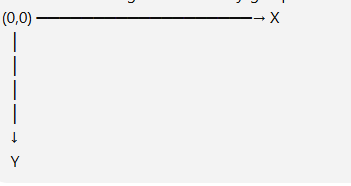

# 🎮 PYGAME – CHEAT SHEET

## 1. Vad är Pygame?

Pygame är ett Python-bibliotek som används för att skapa spel och andra interaktiva program.

**Med Pygame kan du bland annat:**

Skapa ett game window
Rita figurer och bakgrunder
Visa bilder
Spela ljud och musik
Läsa av tangentbord och mus
Flytta spelare och objekt
Kontrollera kollisioner
Visa text
Skapa spel-loopar

## 2. Starta Pygame

Börja med att importera Pygame:

**import pygame**


Sedan måste Pygame startas:

**pygame.init()**

Komplett grundstruktur
import pygame

**pygame.init()**

**screen = pygame.display.set_mode((800, 600))**
**pygame.display.set_caption("Mitt spel")**

**running = True**
```
while running:

    for event in pygame.event.get():

        if event.type == pygame.QUIT:
            running = False

    pygame.display.flip()

pygame.quit()
```

### Förklaring
**Kod	Funktion**
|Kod | Förklaring|
|-|-|
|import pygame| Importerar Pygame|
|pygame.init()	|Startar Pygame|
|set_mode()|	Skapar spelfönstret|
|set_caption()|	Ger fönstret ett namn|
|running = True|	Spelet ska fortsätta|
|while running:|	Game loop|
|pygame.event.get()|	Hämtar händelser|
|pygame.QUIT|	Kontrollerar om fönstret stängs|
|pygame.display.flip()	|Uppdaterar skärmen|
|pygame.quit()	|Avslutar Pygame|

## 3. Starta och avsluta spelet
Starta
**pygame.init()**

Avsluta
**pygame.quit()**


Ett vanligt sätt att avsluta spelet:

```
if event.type == pygame.QUIT:
    running = False
```

När running blir False avslutas:
```
while running:

```
och därefter körs:
```
pygame.quit()
```
## 4. Skapa Game Window
```
screen = pygame.display.set_mode((800, 600))

```
Det betyder:

800 = bredd
600 = höjd


Exempel:
```
screen = pygame.display.set_mode((1280, 720))
```

ger ett fönster på:

1280 × 720

Byta namn på fönstret
```
pygame.display.set_caption("Super Mario")
```
## 5. Bakgrund med färg

För att fylla hela skärmen med en färg används:

```
screen.fill("blue")
```

Exempel:
```
screen.fill("black")
```
RGB-färger

Du kan också använda RGB:
```
screen.fill((255, 0, 0))
```

Det ger röd färg.

RGB fungerar så här:

(RÖD, GRÖN, BLÅ)


Exempel:

(255, 0, 0)       # Röd
(0, 255, 0)       # Grön
(0, 0, 255)       # Blå
(255, 255, 255)   # Vit
(0, 0, 0)         # Svart

## 6. Bakgrund med bild

Ladda först bilden:
```
background = pygame.image.load("background.png")
```

Visa sedan bilden:
```
screen.blit(background, (0, 0))
```
Komplett exempel
```
import pygame

pygame.init()

screen = pygame.display.set_mode((800, 600))

background = pygame.image.load("background.png")

running = True

while running:

    for event in pygame.event.get():
        if event.type == pygame.QUIT:
            running = False

    screen.blit(background, (0, 0))

    pygame.display.flip()

pygame.quit()

Anpassa bilden till fönstret
background = pygame.image.load("background.png")

background = pygame.transform.scale(
    background,
    (800, 600)
)
```

## 7. Visa en bild på skärmen

Ladda bilden:
```
player_image = pygame.image.load("player.png")
```

Visa bilden:
```
screen.blit(player_image, (100, 200))
```

Här betyder:

100 = X-position
200 = Y-position


**Koordinatsystemet i Pygame:**  



Alltså:

(0, 0) = övre vänstra hörnet

## 8. Flytta en bild

Det viktigaste för att flytta ett objekt är att använda variabler för dess position.
```
player_x = 100
player_y = 200
```

Visa bilden:
```
screen.blit(player_image, (player_x, player_y))
```

Flytta bilden:
```
player_x += 5
```

Nu flyttas bilden åt höger.

## 9. Flytta en bild med tangentbordet

Ett enkelt exempel:
```
player_x = 100
player_y = 200

while running:

    for event in pygame.event.get():
        if event.type == pygame.QUIT:
            running = False

    keys = pygame.key.get_pressed()

    if keys[pygame.K_LEFT]:
        player_x -= 5

    if keys[pygame.K_RIGHT]:
        player_x += 5

    if keys[pygame.K_UP]:
        player_y -= 5

    if keys[pygame.K_DOWN]:
        player_y += 5

    screen.fill("black")

    screen.blit(player_image, (player_x, player_y))

    pygame.display.flip()

#Rörelserna
player_x -= 5


#Flyttar vänster.

player_x += 5


#Flyttar höger.

player_y -= 5


#Flyttar upp.

player_y += 5


#Flyttar ner.
```

## 10. Tangentbord – knappar

För att läsa av tangentbordet:
```
keys = pygame.key.get_pressed()
```

Sedan kan du kontrollera knappar.

| Knapp | Pygame-kod | Funktion |
|---|---|---|
| W | pygame.K_w | Upp |
| S | pygame.K_s | Ner |
| A | pygame.K_a | Vänster |
| D | pygame.K_d | Höger |
| ↑ | pygame.K_UP | Upp |
| ↓ | pygame.K_DOWN | Ner |
| ← | pygame.K_LEFT | Vänster |
| → | pygame.K_RIGHT | Höger |
| Space | pygame.K_SPACE | Mellanslag |
| Esc | pygame.K_ESCAPE | Escape |
| Enter | pygame.K_RETURN | Enter |
| Tab | pygame.K_TAB | Tab |
| Shift | pygame.K_SHIFT | Shift |
| Ctrl | pygame.K_CTRL | Ctrl |


Exempel:
```
if keys[pygame.K_SPACE]:
    print("Hoppa!")

#11. KEYDOWN – när en knapp trycks

Det finns skillnad mellan:

pygame.key.get_pressed()

```
och:
```
pygame.KEYDOWN
```

KEYDOWN används när en tangent trycks ner.
```
for event in pygame.event.get():

    if event.type == pygame.KEYDOWN:

        if event.key == pygame.K_SPACE:
            print("Space trycktes!")
```

Det passar bra för saker som ska hända en gång.

Exempel:

SPACE → skjut
ENTER → starta
ESC → pausa

## 12. Musfunktioner

Hämta musens position:

mouse_x, mouse_y = pygame.mouse.get_pos()


Exempel:
```
print(mouse_x, mouse_y)
```

Kontrollera musknappar:
```
mouse = pygame.mouse.get_pressed()
```

Vänster musknapp:
```
if mouse[0]:
    print("Vänsterklick")
```

Höger musknapp:
```
if mouse[2]:
    print("Högerklick")
```

## 13. Rita rektanglar

```
pygame.draw.rect(
    screen,
    "red",
    (100, 100, 200, 100)
)

```
Ordningen är:

screen
färg
x
y
bredd
höjd


Exempel:
```
pygame.draw.rect(screen, "blue", (50, 50, 100, 100))
```

## 14. Rita cirklar
```
pygame.draw.circle(
    screen,
    "red",
    (400, 300),
    50
)
```

Här betyder:

(400, 300) = centrum
50 = radie

## 15. Använda Rect

pygame.Rect är mycket användbart för spelobjekt.
```
player = pygame.Rect(100, 100, 50, 50)
```

Det betyder:

x = 100
y = 100
bredd = 50
höjd = 50


Rita den:
```
pygame.draw.rect(screen, "red", player)
```

Flytta:
```
player.x += 5
```

eller:
```
player.y += 5
```

## 16. Kollisioner

Kontrollera om två objekt krockar:

```
if player.colliderect(enemy):
  print("Kollision!")
```

Exempel:
```
player = pygame.Rect(100, 100, 50, 50)
enemy = pygame.Rect(300, 100, 50, 50)

if player.colliderect(enemy):
    print("Du blev träffad!")
```

Det används ofta för:

Spelare mot fiende
Spelare mot vägg
Kulor mot fiender
Spelare mot föremål
Mynt som plockas upp
17. FPS – spelhastighet

Använd en Clock:
```
clock = pygame.time.Clock()
```

I slutet av game loopen:
```
clock.tick(60)
```

Det betyder ungefär:

Max 60 FPS


Exempel:

while running:

    # EVENTS

    # UPDATE

    # DRAW

    pygame.display.flip()

    clock.tick(60)

## 18. Bilder – vanliga funktioner
**Ladda bild**
```
pygame.image.load("player.png")
```
**Visa bild**
```
screen.blit(image, (x, y))
```
**Ändra storlek**
```
pygame.transform.scale(image, (100, 100))
```
**Rotera**
```
pygame.transform.rotate(image, 90)
```
**Spegelvänd**
```
pygame.transform.flip(image, True, False)
```
## 19. Text

**Skapa ett font-objekt:**
```
font = pygame.font.Font(None, 36)
```

**Skapa text:**
```
text = font.render("Hello World!", True, "white")
```

**Visa texten:**
```
screen.blit(text, (100, 100))
```

Exempel
```
font = pygame.font.Font(None, 50)

text = font.render(
    "GAME OVER",
    True,
    "red"
)

screen.blit(text, (300, 250))
```

## 20. Ljud

**Ladda ett ljudeffekt:**

```
sound = pygame.mixer.Sound("jump.wav")
```

**Spela ljudet:**
```
sound.play()
```
**Musik**
```
pygame.mixer.music.load("music.mp3")
pygame.mixer.music.play(-1)
```

-1 betyder att musiken loopar.

**Stoppa musiken:**
```
pygame.mixer.music.stop()
```

## 21. Game Loop – den viktigaste delen

Nästan alla Pygame-spel bygger på en loop:

```
while running:

    # 1. EVENTS
    for event in pygame.event.get():
        if event.type == pygame.QUIT:
            running = False

    # 2. UPDATE
    # Flytta spelare
    # Kontrollera kollisioner
    # Uppdatera fiender

    # 3. DRAW
    screen.fill("black")
    screen.blit(player_image, (player_x, player_y))

    # 4. VISA
    pygame.display.flip()

    # 5. FPS
    clock.tick(60)
```

Tänk:

EVENTS
   ↓
UPDATE
   ↓
DRAW
   ↓
DISPLAY
   ↓
LOOP

## 22. Komplett exempel – rörlig spelare
```
import pygame
 
pygame.init()

### Game window
screen = pygame.display.set_mode((800, 600))
pygame.display.set_caption("Mitt spel")

### Clock
clock = pygame.time.Clock()

### Player
player_image = pygame.image.load("player.png").convert_alpha()
player_image = pygame.transform.scale(player_image, (64, 64))

player_x = 100
player_y = 100

### Game loop
running = True

while running:

    # -----------------
    # EVENTS
    # -----------------

    for event in pygame.event.get():

        if event.type == pygame.QUIT:
            running = False

    # -----------------
    # INPUT
    # -----------------

    keys = pygame.key.get_pressed()

    if keys[pygame.K_LEFT]:
        player_x -= 5

    if keys[pygame.K_RIGHT]:
        player_x += 5

    if keys[pygame.K_UP]:
        player_y -= 5

    if keys[pygame.K_DOWN]:
        player_y += 5

    # -----------------
    # DRAW
    # -----------------

    screen.fill("darkgreen")

    screen.blit(
        player_image,
        (player_x, player_y)
    )

    # -----------------
    # UPDATE SCREEN
    # -----------------

    pygame.display.flip()

    # 60 FPS
    clock.tick(60)

pygame.quit()
```

## 23. Viktiga inbyggda Pygame-funktioner
### Funktion	Vad den gör
## Viktiga Pygame-funktioner

| Funktion | Förklaring |
|---|---|
| `pygame.init()` | Startar Pygame |
| `pygame.quit()` | Avslutar Pygame |
| `pygame.display.set_mode()` | Skapar spelfönster |
| `pygame.display.set_caption()` | Ändrar fönstrets namn |
| `pygame.display.flip()` | Uppdaterar skärmen |
| `pygame.event.get()` | Hämtar events |
| `pygame.key.get_pressed()` | Läser tangentbordet |
| `pygame.mouse.get_pos()` | Hämtar musens position |
| `pygame.mouse.get_pressed()` | Läser musknappar |
| `pygame.image.load()` | Laddar bild |
| `screen.blit()` | Visar bild |
| `screen.fill()` | Fyller skärmen med färg |
| `pygame.draw.rect()` | Ritar rektangel |
| `pygame.draw.circle()` | Ritar cirkel |
| `pygame.draw.line()` | Ritar linje |
| `pygame.Rect()` | Skapar rektangel/objekt |
| `colliderect()` | Kontrollerar kollision |
| `pygame.transform.scale()` | Ändrar bildens storlek |
| `pygame.transform.rotate()` | Roterar bild |
| `pygame.font.Font()` | Skapar font |
| `font.render()` | Skapar textbild |
| `pygame.mixer.Sound()` | Laddar ljudeffekt |
| `sound.play()` | Spelar ljud |
| `pygame.time.Clock()` | Skapar spelklocka |
| `clock.tick()` | Begränsar FPS |
| `pygame.time.get_ticks()` | Hämtar tid sedan Pygame startade |

## Viktiga Pygame Events

| Event | Funktion |
|---|---|
| `pygame.QUIT` | Fönstret stängs |
| `pygame.KEYDOWN` | Tangent trycks ner |
| `pygame.KEYUP` | Tangent släpps |
| `pygame.MOUSEBUTTONDOWN` | Musknapp trycks |
| `pygame.MOUSEBUTTONUP` | Musknapp släpps |
| `pygame.MOUSEMOTION` | Musen rör sig |


Exempel:
```
for event in pygame.event.get():

    if event.type == pygame.KEYDOWN:

        if event.key == pygame.K_SPACE:
            print("Hoppa!")

    if event.type == pygame.MOUSEBUTTONDOWN:
        print("Mus klickad!")
```

## 25. Viktiga Rect-funktioner

Om du har:

```
player = pygame.Rect(100, 100, 50, 50)
```

## 📦 pygame.Rect

Skapa ett objekt:

    player = pygame.Rect(100, 100, 50, 50)

### Vanliga funktioner

- `player.x` → X-position
- `player.y` → Y-position
- `player.width` → Bredd
- `player.height` → Höjd
- `player.center` → Objektets mittpunkt
- `player.move_ip(5, 0)` → Flyttar objektet
- `player.colliderect(enemy)` → Kontrollerar kollision
- `player.collidepoint(x, y)` → Kontrollerar om en punkt finns i objektet

### Exempel

Flytta spelaren:
```
    player.x += 5
```
Kontrollera kollision:
```
    if player.colliderect(enemy):
        print("Kollision!")
```
Kontrollera musen:
```
    if player.collidepoint(mouse_x, mouse_y):
        print("Musen är över spelaren!")
```

## 26. Bra struktur för ett Pygame-spel

Ett större spel kan delas upp så här:

```
GAME
│
├── Initiering
│   ├── pygame.init()
│   ├── window
│   ├── images
│   └── sounds
│
├── Events
│   ├── keyboard
│   ├── mouse
│   └── quit
│
├── Update
│   ├── player movement
│   ├── enemies
│   ├── collisions
│   └── score
│
├── Draw
│   ├── background
│   ├── player
│   ├── enemies
│   └── text
│
└── Game loop
```

⭐ Kom ihåg

De fem viktigaste sakerna att förstå i Pygame är:

1. EVENT  
  - Vad gör spelaren?  

2. INPUT  
  - Vilken tangent/mus används?  

3. UPDATE  
 -  Hur förändras spelet?  

4. DRAW  
  - Vad ska ritas på skärmen?  

5. GAME LOOP  
 -  Upprepa allt tills spelaren avslutar.  

Minimal mall
```
import pygame

pygame.init()

screen = pygame.display.set_mode((800, 600))
clock = pygame.time.Clock()

running = True

while running:

    # EVENTS
    for event in pygame.event.get():
        if event.type == pygame.QUIT:
            running = False

    # UPDATE


    # DRAW
    screen.fill("black")


    # DISPLAY
    pygame.display.flip()
    clock.tick(60)

pygame.quit()
```

Detta är grunden som du kan bygga nästan vilket 2D-spel som helst på.
